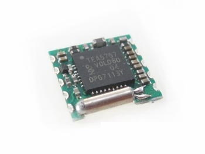

![No Std][no-std-badge]
# TEA5767
Rust platform agnostic driver for the TEA5767, electronically tuned FM stereo radio. 
An additional description can be found in the device datasheet.
The datasheet is placed in doc folder of this repository.
The driver is based on [`embedded-hal`] traits and I2C.



## Usage
General initialization code, which create new instance of TEA5767 with default configuration.
Here you can specify radio channel frequency, band limit, and sound mode. To change this default
behaviour and to control the device use methods defined in _defs_ module. Additional information
about this methods can be obtained from examples folder.
```rust
use tea5767::defs::*;
let radio_tuner = TEA5767::new(
    i2c,
    107.0,
    BandLimits::EuropeUS,
    SoundMode::Stereo
).unwrap();
```

## Support

For questions, issues, feature requests, and other changes, please file an
[issue in the github project](https://github.com/Nekspire/tea5767/issues).

## License

Licensed under either of

* Apache License, Version 2.0 ([LICENSE-APACHE](LICENSE-APACHE) or
  http://www.apache.org/licenses/LICENSE-2.0)
* MIT license ([LICENSE-MIT](LICENSE-MIT) or
  http://opensource.org/licenses/MIT)

at your option.

### Contributing

Unless you explicitly state otherwise, any contribution intentionally submitted
for inclusion in the work by you, as defined in the Apache-2.0 license, shall
be dual licensed as above, without any additional terms or conditions.

[`embedded-hal`]: https://github.com/rust-embedded/embedded-hal

<!-- Badges -->
[no-std-badge]: https://img.shields.io/badge/no__std-yes-blue